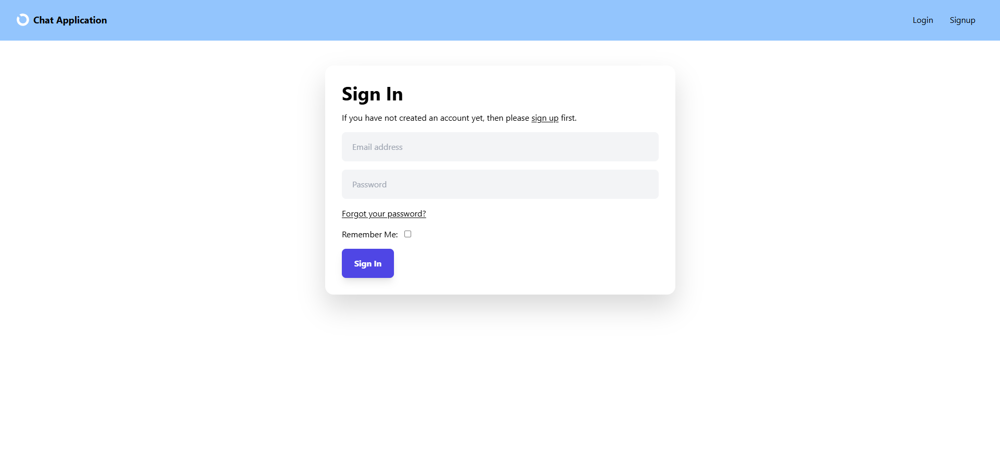
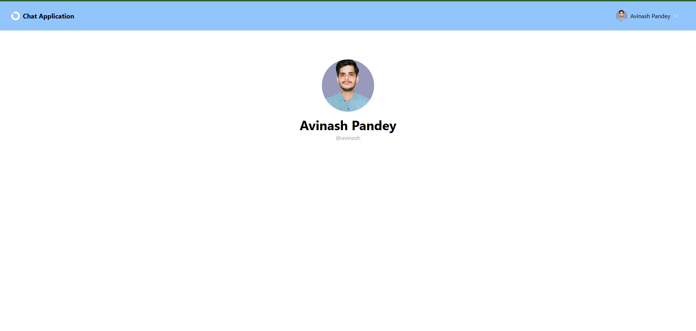
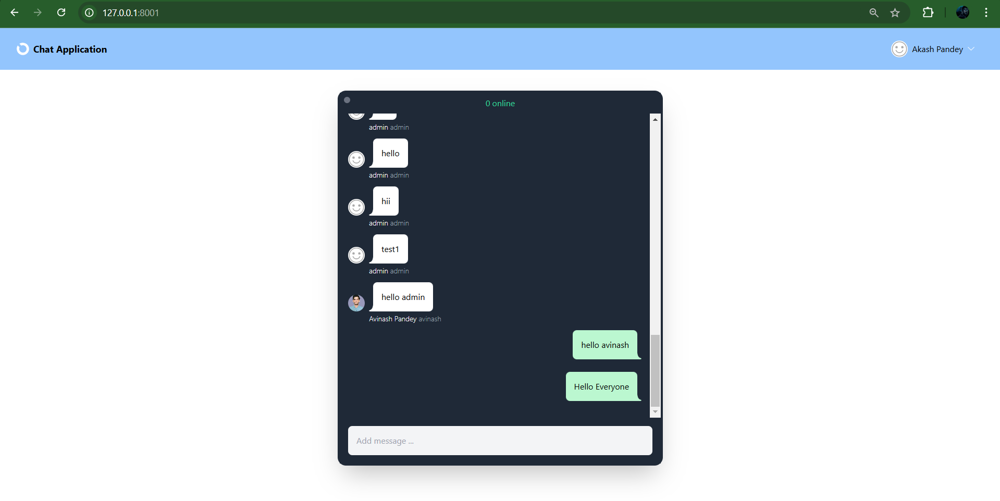

# Real-Time Chat Application

This is a real-time chat application built using Django. It features user authentication, private and public chat groups, real-time messaging using WebSocket, and a user-friendly interface.

## Features

- User authentication (login and registration).
- Real-time messaging using WebSocket.
- Support for public and private chat groups.
- Online user tracking.
- Responsive UI.

---

## Prerequisites

- Python 3.8 or higher.
- Django 4.0 or higher.
- A WebSocket server (e.g., Django Channels).
- A database like SQLite, MySQL, or PostgreSQL.

---

## Installation and Setup

Follow these steps to run the application locally:

### 1. Clone the Repository

```bash
https://github.com/avinash38143/RealTime_ChatApplication.git
cd realtime-chat-app
```

### 2. Create and Activate a Virtual Environment

```bash
python -m venv venv
source venv/bin/activate  # On Windows: venv\Scripts\activate
```

### 3. Install All Dependencies

```bash
pip install -r requirements.txt
```

### 4. Configure the Database

By default, the application uses SQLite. If you want to use a different database, update the `DATABASES` setting in `settings.py`.

Run the migrations:

```bash
python manage.py makemigrations
python manage.py migrate
```

### 5. Create a Superuser

Create an admin account to access the admin panel:

```bash
python manage.py createsuperuser
```

### 6. Run the WebSocket Server

Ensure Django Channels is installed and configured in `settings.py`. Then start the development server:

```bash
python manage.py runserver
```

The application will be available at `http://127.0.0.1:8000/`.

---

## Screenshots

### Login Page


### Profile Page


### Real-Time Chat Interface


---

## Folder Structure

```plaintext
realtime-chat-app/
|-- a_realChat/            # Main application folder
|-- templates/             # HTML templates
|-- static/                # Static files (CSS, JS, images)
|-- media/                 # Media uploads (optional)
|-- manage.py              # Django management script
|-- db.sqlite3             # Default database (SQLite)
|-- requirements.txt       # Python dependencies
```

---

## Dependencies

- Django
- Django Channels
- ASGI Server (Daphne or similar)
- ShortUUID

Install these dependencies using `pip`:

```bash
pip install django channels daphne shortuuid
```

---

## Usage

1. Register a new user or log in with an existing account.
2. Create or join chat groups (public or private).
3. Start chatting in real-time.

---

For more details, check out the [Django Documentation](https://docs.djangoproject.com/).

